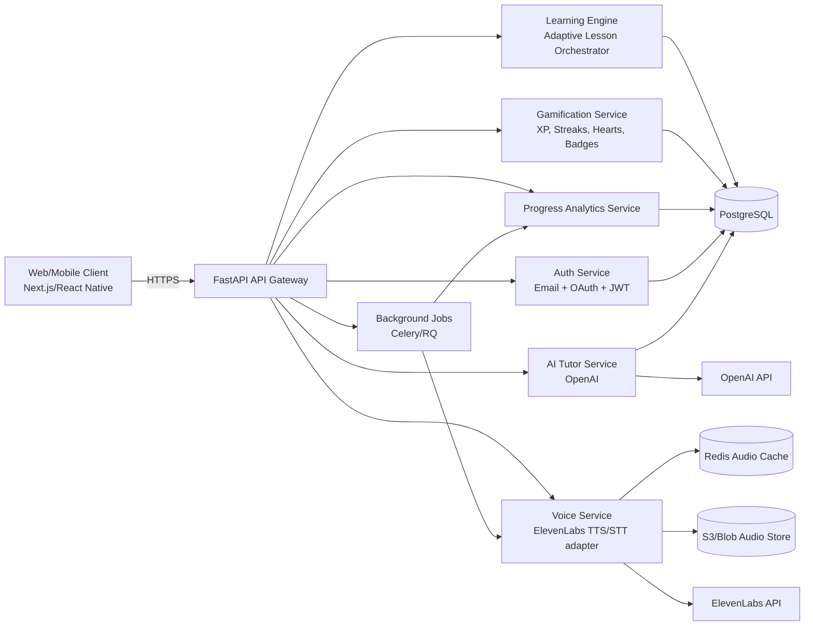

# 1) App Architecture Diagram

## Scalability Notes
- Stateless API pods behind load balancer.
- Read replicas for analytics and leaderboard reads.
- Redis for hot cache (audio, sessions, leaderboard snapshots).
- Async jobs for TTS pre-generation, recommendation updates, and badge calculations.
- Event-driven telemetry (`lesson_completed`, `mistake_made`, `streak_updated`) for personalization.
